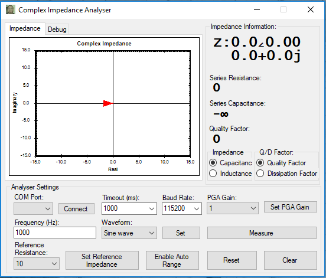

# Instrumentation Coursework 2020

The coursework done by Josh Jennings and Jack Waller for ELEC96020 - Instrumentation.

- [Instrumentation Coursework 2020](#instrumentation-coursework-2020)
  - [Design Goals](#design-goals)
  - [Software Implementation](#software-implementation)
  - [Hardware Implementation](#hardware-implementation)
  - [Results](#results)

## Design Goals

The design goals are to simulate, prototype and demonstrate a complex impedance measurement instrument which can measure momplex impedances: 

* At several spot frequencies, at least {1kHz, 10kHz, 100kHz} (+optionally 1MHz)
* Impedance magnitudes from 10 Ohm to 1 M Ohm 
* Impedance or admittance phase from -180 degrees to +180 degrees with 5 degrees accuracy.

## Software Implementation

The application consists of a hardware instrument that is controlled using desktop application utilising UART.

The desktop application is written in C# and the embedded code is written in C++.

## Hardware Implementation

The schematic files can be found [on circuit maker](https://workspace.circuitmaker.com/Projects/Details/jack-waller/Instrumentation2020).

The microcontroller used is the [NUCLEO F446RE](https://os.mbed.com/platforms/ST-Nucleo-F446RE/).

## Results

Information on how this works and the final results can be seen in the reports in the [documentation folder](https://github.com/joshjennings98/instrumentation-2020/tree/master/Documentation).